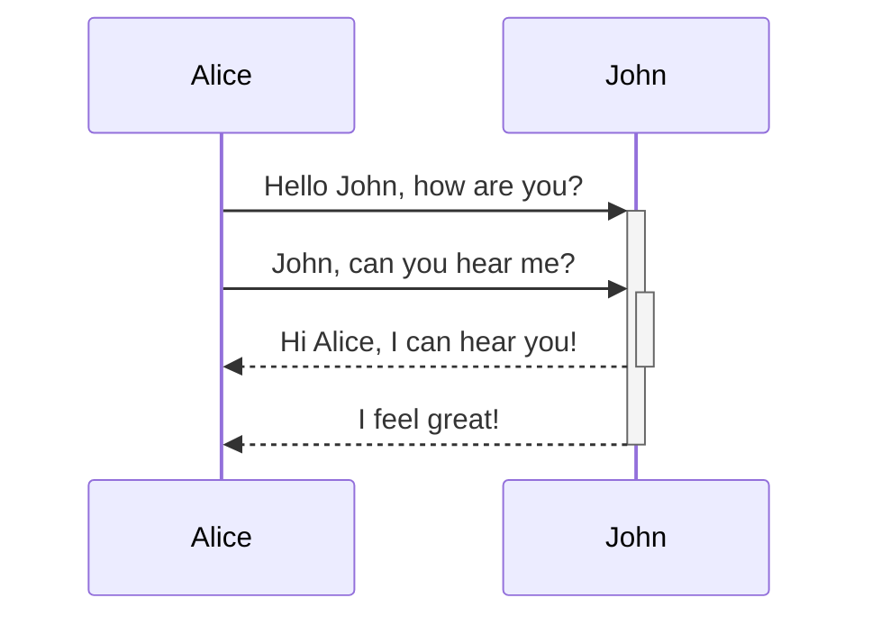

# Nativo

## Titulo 2

### Titulo 3

#### Titulo 4

```javascript
let linguagem = 'javasript';
```

> Bloco de citação

> [!note] Anotação
> Bloco de citação com estilizado

- [x] Task
- [ ] Task 2
- [ ] Task 3
- [ ] Task 4

- Lista não ordenada
- Lista2
 
1. Lista Ordenada
2. Lista2

| Carro                  |     Valor |
|:---------------------- | ---------:|
| Saveiro SuperSurf 2007 | 25.500,20 |
| Gol G5                 | 27.520,50 |
| Amarok                 | 45.760,50          |

```Markdown
[[Basico]] = Link Basico
[[Basico|Renomeado]] = Link Renomiando
[[Bubble Sort#^b42eba]] = Link Bloco especifico
[[Bubble Sort#Algoritmo]] = Titulo Especifico
<https://google.com> = Link Externo exibindo o link
[Google](https://google.com) = Link Externo com mascara
 = Adicionando Imagem
#ordenação = Tags
```

$$\begin{vmatrix}a & b\\ c & d \end{vmatrix}=ad-bc$$
Matemática em bloco e in-line $e^{2i\pi} = 1$ .

==Texto destacado com 2 iguais==

%%Comentários como em toda boa ferramenta%%

> [!info]
> Callout




# Plugin Admoniton
```ad-info
title: Relato
collapse: close
color: 300, 300, 300

```ad-bug
title: Erro! no  console
~~~js
console.erro('Erro!')
~~~
```
```ad-bug
icon: dragon

Lorem ipsum dolor sit amet, consectetur adipiscing elit. Nulla et euismod nulla.

```


# Dataview

## Block code

```dataview
TABLE title as Titulo, author as Autor
FROM #article
SORT title ASC
LIMIT 2
```

```dataview
LIST "File Path: " + file.path FROM "01 - Notes/Code"
LIMIT 2
```

```dataview
TASK
WHERE !completed
GROUP BY file.folder
LIMIT 1
```

## In-line 

- HTML Puro 
	<progress value="50" max="100"></progress>
- Dataview 
	`= "<progress value='" + (length(filter(this.file.tasks.completed, (t) => t = true)) / length(this.file.tasks)) * 100 + "' max='100'></progress>" + "<br>" + round((length(filter(this.file.tasks.completed, (t) => t = true)) / length(this.file.tasks)) * 100) + "% completed"`

`= this.file.name`
`= this.file.mtime`